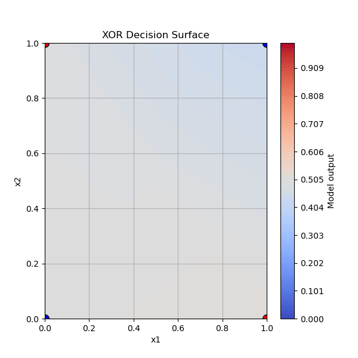

# XOR Classification

A second experiment (non-linear) for the micrograd build

---

## Things that this one forced me to do/think about:
  - **Altering activation functions in hidden/output layers.
      - Updated the neural net to accept activation inputs for hidden layers and a separate activation for output layers (tanh, sigmoid, relu, leaky_relu, None=> linear activation)
  - ** Visualizing training behavior** using contour plots with matplotlib:
    - Since the input is 2D we can visualize 'decision surfaces' as training progressed
    - Created two gifs to show how these decision boundaries evolved over time. 
---  

## Visualizations
  -  pink/yellow ('spring') contour plot for a single hidden layer (2 neurons). We can see some learning taking place! The second, involves 2 hidden layers or 8 and 4 neurons respectively. This gets a little closer to a 'checker board' that we might hope for but training seemed to be finicky...
      - **simple model**: a single hidden layer of **2** neurons and **750** epochs:
        
      - **bigger model**: two hidden layers of **8** and **4** neurons respectively and **1200** epochs:
        

---

## Okay... what do the neurons learn??

So I REALLY like the idea of interpretability and want to learn all that I can about it... so I am starting SMALL here. Towards this goal we can visualize what a model thinks neuron by neuron by creating an 'activation map' and then, after some slight tweaks to the nn drawing code from https://gist.github.com/craffel/2d727968c3aaebd10359, output the following diagram:

  -  **XOR neural activity**:
    

